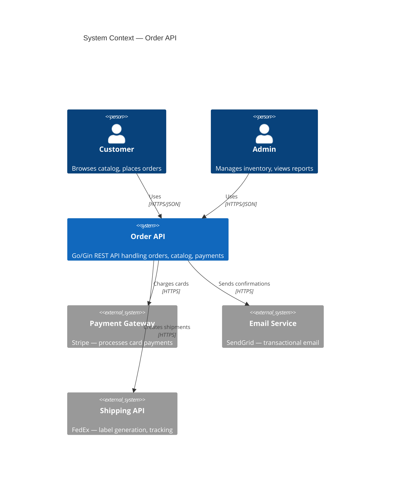
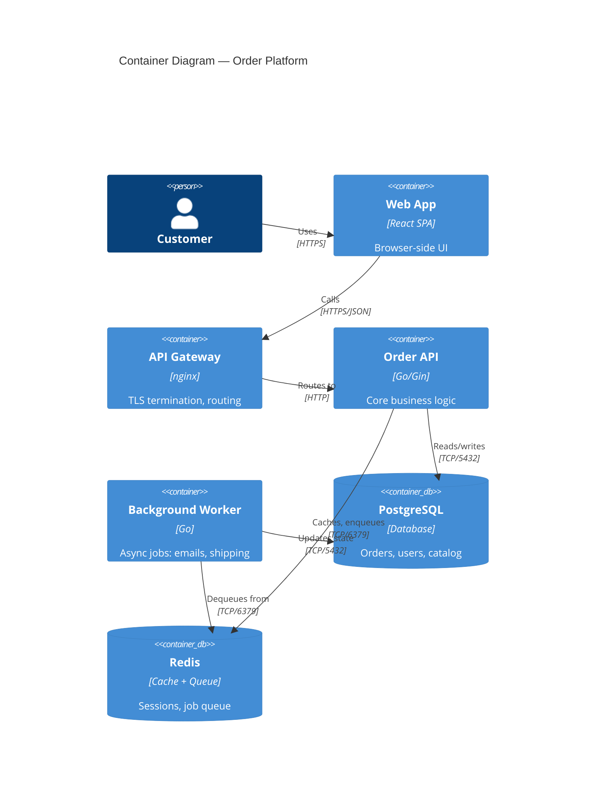
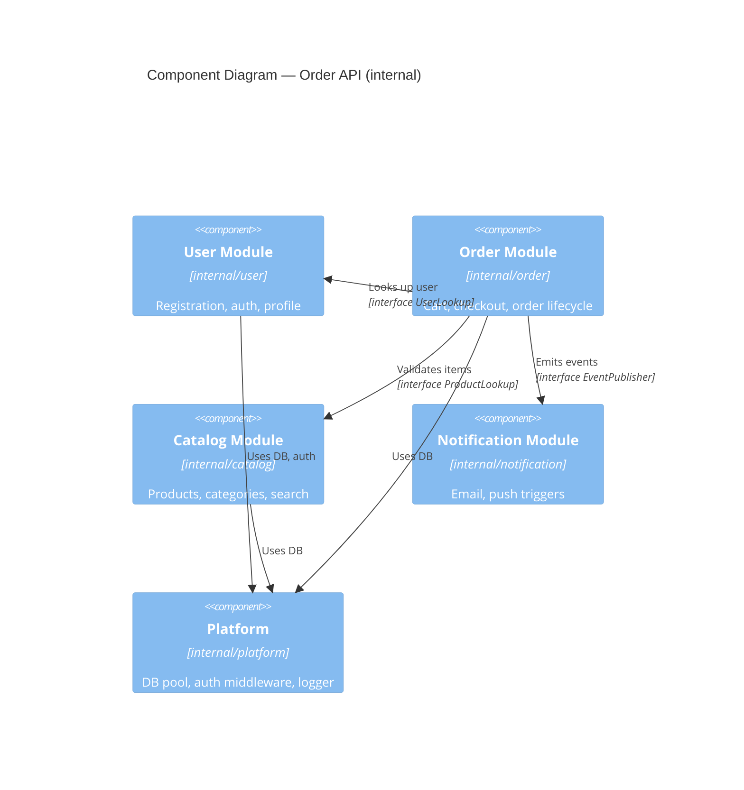

# System Design — C4 Model for Go APIs

When and how to use C4 diagrams for Go Gin API architecture documentation.

> **Default stance:** A CRUD API with a single team does NOT need C4 diagrams. Use when complexity is real and measured, not anticipated.

---

## When to Use Each Level

| Level | Use when |
| --- | --- |
| **Context** | Always — one diagram, 5 min to draw, answers "what does this system do and who talks to it?" |
| **Container** | You have multiple deployable units (API + worker + frontend + DB) |
| **Component** | A single container has enough internal complexity that new devs get lost |
| **Code** | Almost never. Use Go doc comments + package structure instead. |

If you have a single Gin API talking to one PostgreSQL database: draw Context, stop there.

---

## Level 1 — Context Diagram

Shows the system boundary and its actors/external systems. One box per external thing.

**Rule:** If you can't fit this on one page, you have too many external dependencies — that's the real problem to solve.

---

## Level 2 — Container Diagram

Shows deployable units. Use when you have more than one process running.

---

## Level 3 — Component Diagram

Shows internal structure of one container. Use only when a container has 5+ distinct responsibilities and onboarding new devs takes more than a day.

**Go-specific mapping:** Each C4 component maps to a Go package under `internal/`. The arrows between components must be satisfied by Go interfaces — this prevents import cycles and enforces boundaries.

## Level 4 — Code Level

Skip it. Go package documentation, `go doc`, and readable package structure do this better with zero maintenance cost.

---

## Cross-Skill References

- For bounded context analysis: see **[system-design-bounded-contexts.md](system-design-bounded-contexts.md)**
- For project structure by scale: see **[system-design-project-structure.md](system-design-project-structure.md)**
- For complexity budget: see **[complexity-assessment.md](complexity-assessment.md)**
